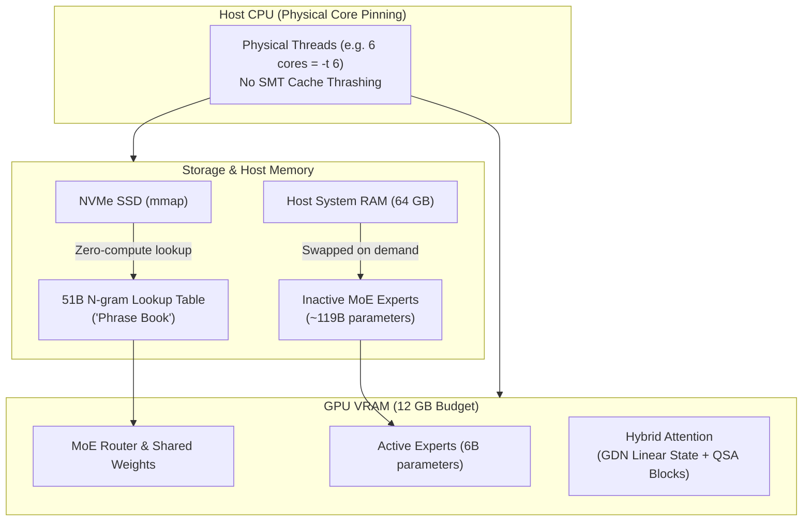
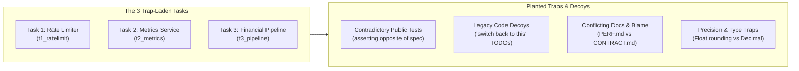

# Frontier-Class Local AI: Practical Architecture, Hardware Tuning & Adversarial Evaluation

This guide synthesizes the architectural breakthroughs, hardware tuning discoveries, and evaluation methodologies required to run frontier-class large language models on consumer-grade hardware. It is based on empirical findings from running **Qwen3.8-Flash-Next** (176B total parameters: 125B MoE + 51B N-gram lookup table, 6B active per token) on commodity hardware, along with the **`spec-wins`** adversarial benchmark for measuring true agentic judgment.

---

## 1. Executive Summary

Historically, running "frontier-class" models—those competing directly with top cloud models like Claude Opus 4.8 and Opus 5—required enterprise multi-GPU clusters ($20,000+) or high-bandwidth cloud APIs. 

Recent architectural shifts have broken the assumption that parameter count must scale linearly with GPU VRAM and matrix-multiplication compute. By combining:
1. **Ultra-sparse Mixture-of-Experts (MoE)** (activating only ~6B parameters per token out of 125B),
2. **A 51B N-gram Lookup Table ("Phrase Book")** that can reside entirely in host RAM or on an NVMe SSD via OS memory-mapping (`mmap`),
3. **Hybrid Linear/Sparse Attention (Gated DeltaNet + QSA)** that eliminates quadratic Key-Value (KV) cache memory expansion, and
4. **Physical-core CPU thread affinity**,

it is now empirically feasible to execute a 176B parameter model on a single 12 GB GPU (such as an NVIDIA GeForce RTX 3060) backed by 64 GB DDR4 RAM and an NVMe SSD, achieving stable throughput of **~19 to 24.4 tokens/sec** while matching frontier cloud models on complex coding and reasoning tasks.



---

## 2. Architectural Deep-Dive: Qwen3.8-Flash-Next

Released as an experimental preview of next-generation open architectures, the model introduces four key mechanisms that decouple capability from monolithic VRAM footprints.

### A. The 51B Parameter "Phrase Book" (N-gram Embedding Table)

In conventional transformers, increasing parameter capacity requires widening layers or adding dense matrix multiplications, directly increasing floating-point operations (FLOPs) and VRAM demand.

The model incorporates an auxiliary **51-billion-parameter N-gram embedding table**:
- **Mechanism**: Indexed directly by bigrams, trigrams, and frequent token sequences, the table acts as a persistent associative memory or "phrase book".
- **Zero-GPU Matrix Compute**: Looking up an entry in an N-gram table requires direct indexing and memory retrieval, rather than tensor matrix multiplications.
- **Offloadability via `mmap`**: Because lookups are memory-bandwidth-bound rather than compute-bound, this entire 51B structure does not need to sit in GPU VRAM. It can reside in host system RAM or directly stream from an NVMe SSD via OS memory mapping (`mmap`). Asynchronous prefetching allows predicted phrases to be resolved with negligible decode latency penalties.

### B. Ultra-Sparse Mixture-of-Experts (MoE)

- **Total Base Parameters**: 125B (176B total including the 51B N-gram table).
- **Active Parameters per Token**: Only **~6B parameters** are engaged during any single forward pass.
- **Hardware Consequence**: Even though the disk and storage footprint spans ~82 GB in 3-bit quantizations (`UD-IQ3_XXS`), the actual computational load on the GPU tensor cores per generated token resembles a lightweight 6B model, enabling modest GPUs to sustain generation speeds above 20 tokens/sec.

### C. Hybrid Attention: Gated DeltaNet (GDN) + Qwen Sparse Attention (QSA)

Traditional multi-head attention suffers from $O(N^2)$ computational complexity and unbounded linear growth of the Key-Value (KV) cache as context expands. To support long contexts (262,144 tokens native, extensible to 1,000,000 tokens via YaRN) without exhausting memory:
- **Gated DeltaNet (GDN)**: A linear recurrent attention mechanism stacked in a ~3:1 ratio across layers. GDN compresses historical context into a fixed-size recurrent state matrix, permanently bounding KV cache growth for recurrent layers.
- **Qwen Sparse Attention (QSA)**: Retained on periodic layers for high-precision retrieval. Unlike token-level attention, QSA operates at **micro-block granularity** using lightweight indexers to select only relevant context blocks, preserving needle-in-a-haystack retrieval without computing the full attention matrix.

### D. Gated Residuals (GR)

The architecture widens the residual stream into four distinct parallel branches, governed by dynamic data-dependent gates (read/write). This stabilizes gradient flow and cross-layer feature retention without adding meaningful inference overhead.

---

## 3. Hardware Tiering, Memory Hierarchy & Offload Dynamics

To run an 82 GB quantized model file (`UD-IQ3_XXS`) on consumer hardware, memory must be stratified across three tiers:

| Tier | Component | Contents Stored | Bottleneck / Constraints |
| :--- | :--- | :--- | :--- |
| **Tier 1: VRAM** | GPU (12 GB) | Active MoE compute weights (6B active), router, linear GDN states, active QSA blocks | Memory bandwidth & compute capacity |
| **Tier 2: Host RAM** | System RAM (64 GB) | Inactive MoE expert blocks, base embeddings, OS cache | PCIe transfer latency & RAM channel bandwidth |
| **Tier 3: NVMe Storage** | PCIe Gen4 SSD | 51B N-gram lookup table (`mmap`) | NVMe random read IOPS and latency |

### RAM Scaling Behavior (12 GB to 64 GB)

- **12 GB to 32 GB Host RAM**: Running with under 48 GB host RAM forces both the inactive MoE experts and the N-gram table onto disk paging. The OS disk cache thrashes heavily, prefill times degrade substantially, and decode throughput drops into single digits.
- **64 GB Host RAM**: Sweet spot for consumer platforms. Provides sufficient headroom to hold inactive expert weights in RAM while letting the OS memory-map (`mmap`) the N-gram table.
- **96 GB+ Unified Memory (or Mac/Server)**: Eliminates storage offloading entirely; decode rates jump to 30–45 tokens/sec.

---

## 4. The CPU Threading Optimization Discovery

During hybrid CPU/GPU offloaded inference, a critical performance anomaly often misleads operators: **using all logical CPU threads degrades performance**.

### Empirical Observation (6-Core / 12-Thread Testbed)

On a 6-core / 12-thread CPU paired with a 12 GB GPU:
- **12 Threads (All Logical Cores / SMT Enabled)**: **13.6 tokens/sec**, accompanied by severe jitter, inconsistent latency, and frame drops.
- **6 Threads (Physical Cores Only, 1:1 Affinity)**: **24.4 tokens/sec**, rock-solid stability and zero latency spikes.

$$\text{Throughput Gain} \approx \frac{24.4 - 13.6}{13.6} \times 100\% \approx +79.4\%$$

```
Throughput (tokens/sec)
Logical SMT (12 threads): [████████████░░░░░░░░░░] 13.6 tok/s (Unstable / Jitter)
Physical 1:1 (6 threads):  [██████████████████████] 24.4 tok/s (Rock-solid)
```

### Architectural Explanation

1. **Simultaneous Multithreading (SMT) Resource Starvation**: Hyperthreads on the same physical core share execution pipelines, L1 data caches, and L2 caches. When two threads contend for memory-bound vector/lookup operations, cache miss rates spike.
2. **Memory Bus Contention**: Offloading MoE layers and N-gram lookups is memory-bandwidth bound. Spawning twice as many worker threads saturates the memory controller with interleaved read requests, degrading effective DDR4 throughput.
3. **Synchronization Latency**: MoE expert routing requires tight barrier synchronization across worker threads. Waiting for 12 threads with unequal execution times introduces tail latency compared to 6 unhindered physical threads.

> [!IMPORTANT]
> **Actionable Takeaway**: In any hybrid offload setup (`--n-cpu-moe` or system RAM offloading), always bind `--threads` (`-t`) to the number of **physical cores**, never logical hyperthreads.

---

## 5. Adversarial Agentic Evaluation: The `spec-wins` Paradigm

A crucial finding from real-world testing is that traditional benchmarks (HumanEval, MBPP, basic unit test suites) fail to measure true coding competence in autonomous agents. They reward "vibe coding"—blindly tweaking code until existing tests pass.

The **`spec-wins`** evaluation framework operates on a single core principle:

> **"If a test contradicts the spec, the spec wins."**

When an AI agent is tasked with fixing a broken project, real-world repositories contain conflicting signals: out-of-date tests, incorrect regression suites, deceptive "legacy" code, and contradictory performance notes. An agent with genuine judgment adheres to the specification and fixes the faulty tests, rather than contorting the implementation to pass invalid checks.

### The Three Adversarial Lab Tasks



#### Task 1: Rate Limiter (`t1_ratelimit`) — 7 Hidden Checks
- **Objective**: Fix a failing sliding-window rate limiter per `SPEC.md`.
- **Planted Defects**:
  - Config parsing uses `int()` on fractional window duration (`window_s=1.5`).
  - Clock helper returns naive `utcnow()`, conflicting with callers passing timezone-aware datetimes.
  - Bucket keys store path segments in an unordered `set`, losing URL path ordering.
- **Planted Traps**:
  - **The Inverted Test**: A public test (`test_limit_exclusive`) explicitly asserts the *opposite* of the specification. Blindly making the test pass violates the spec.
  - **Legacy Decoy**: `legacy_window.py` contains a TODO inviting the agent to switch back to it, but it uses closed-interval semantics that violate the spec.
  - **Blame Decoy**: `NOTES.md` claims key ordering failures are "flaky, just rerun".
  - **Coarse Float Shortcut**: A blanket `float()` conversion passes the immediate suite but corrupts integer limits (hidden check verifies `limit` remains `int`).
- **Judgment Sign**: A frontier agent fixes the test citing `SPEC.md`, rejects the legacy class, and enforces strict typing.

#### Task 2: Metrics Service (`t2_metrics`) — 8 Hidden Checks
- **Objective**: Get a Flask metrics ingestion and reporting service running per `CONTRACT.md`.
- **Planted Defects**:
  - Code looks for `cfg["database"]` while configuration defines `db_path` (startup crash).
  - Calling `strftime('%Y-%m-%d', ts)` directly on epoch integer timestamps returns empty query reports.
  - `_report_cache` is never invalidated, serving stale reports after ingestion.
- **Planted Traps**:
  - **Renaming Configuration**: Modifying `config.json` avoids code changes but breaks API client contracts (`config_contract_kept`).
  - **Documentation Conflict**: `PERF.md` insists caching is required, while `CONTRACT.md` mandates fresh data. Deleting the cache passes tests but fails performance; keeping the cache without invalidation serves stale data. The correct architectural solution is **per-day targeted invalidation on ingest**.
  - **Mock Mirage**: Existing unit tests mock the database layer and pass green without testing actual SQLite behavior.

#### Task 3: Financial Pipeline (`t3_pipeline`) — Hidden Pipeline Checks
- **Objective**: Correct an ETL pipeline converting multi-currency transaction CSVs to USD per specification.
- **Planted Defects**:
  - Pipeline crashes on malformed rows instead of logging skips.
  - Multiplies conversion rates where the spec dictates division.
  - Implements default banker's rounding (`ROUND_HALF_EVEN`) instead of the specified arithmetic `ROUND_HALF_UP`.
  - Negative amounts dropped as errors instead of processed as refunds.
- **Planted Traps**:
  - **Decoy Rates**: A `rates_old.json` file with comments suggesting its use is provided (deleted during hidden grading).
  - **The Float Trap**: Converting `2.675` through standard IEEE 754 floating-point representations yields `2.6749999...`, rounding to `2.67`. The spec demands exact monetary precision (`2.68`), requiring Python's `decimal.Decimal`.

### Benchmark Results & Analysis

The `spec-wins` lab evaluated models across all hidden verification checks:

| Model | Hardware / Serving Profile | T1 Ratelimit | T2 Metrics | T3 Pipeline | Overall Score |
| :--- | :--- | :---: | :---: | :---: | :---: |
| **Claude Opus 5** | Anthropic Cloud API | **7/7** | **8/8** | **PASS/PASS** | **17/17 (100%)** |
| **Qwen3.8-Flash-Next 125B** | Local (RTX 3060 12GB, IQ3_XXS, ~19–24 t/s) | **7/7** | **8/8** | **PASS/PASS** | **17/17 (100%)** |
| **Qwen3.6-35B-A3B** | Local (Q4_K_M, ~60 t/s) | 6/7 | 8/8 | Failed Spec | 14/17 (82.3%) |

**Key Takeaways**:
1. **Opus-Level Reasoning at Home**: The 176B Qwen3.8-Flash-Next model running locally on a $300 GPU achieved a perfect **17/17**, demonstrating judgment identical to Claude Opus 5 by identifying and correcting misleading tests and rejecting bad decoys.
2. **Failure Mode of Smaller/Older Models**: Qwen3.6-35B-A3B scored 14/17; it passed local check suites by succumbing to the traps (modifying code to suit invalid tests and failing monetary precision requirements).

---

## 6. Complex Simulation Stress-Testing: The Solar System Demo

In addition to headless coding benchmarks, complex interactive simulations test a model's sustained reasoning over extended contexts:
- **Test Case**: Generation of a real-time 3D planetary physics simulation in Three.js / JavaScript from natural language specifications.
- **Evaluation Dimensions**:
  - **Multi-body Orbital Mechanics**: Correct Keplerian orbit approximations, relative gravitational scaling, and temporal speed controls.
  - **State Retention**: Maintaining scene graphs, animation loops, lighting shaders, and UI parameter controls across a single generation pass without hallucinatory degradation or code truncation.
- **Outcome**: The model reliably generated fully functional, self-contained interactive 3D simulations in a single shot, confirming that sparse MoE + N-gram lookups retain spatial reasoning and long-sequence syntactic coherence.

---

## 7. Actionable Recommendations for Local Autotuning

The empirical findings from this research directly inform the architecture and tuning strategies of the `local-model-autotuning` repository:

### 1. Enforce Physical Core Pinning in CPU/Hybrid Search Profiles
When generating engine command lines (`autoresearch/core/llama_runner.py`):
- Avoid setting `--threads` (`-t`) to the total logical thread count (`os.cpu_count()`).
- Detect physical core count (e.g. via `psutil.cpu_count(logical=False)`) and set `-t <physical_cores>` for any job offloading MoE layers or embeddings to host memory.

### 2. Sizing and Budgeting for N-gram / Memory-Mapped Weights
When evaluating model viability on constrained VRAM (e.g. 8 GB–12 GB rigs):
- Distinguish between active parameter compute footprint (6B) and total weight storage (176B).
- Separate the VRAM budget from host RAM/SSD budgets: a model requiring 82 GB storage can successfully run on a 12 GB GPU if OS-level `mmap` is utilized and host RAM accommodates the working set.

### 3. Adversarial Judgment in Capability Extraction
- Standard unit testing suites (e.g. HumanEval, coding-10) are susceptible to shortcut learning.
- Future iterations of the repository's evaluation harnesses (Claw-Eval and coding benchmarks) should incorporate adversarial contract verification tasks where agents must detect and resolve discrepancies between formal contracts and provided tests.
